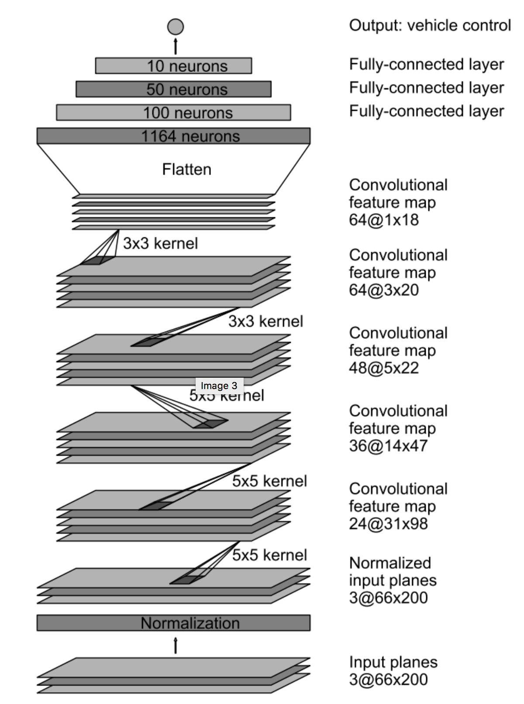
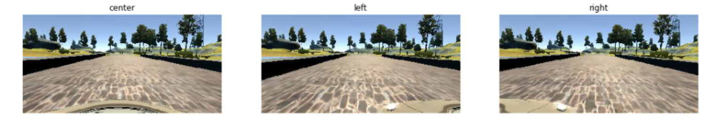
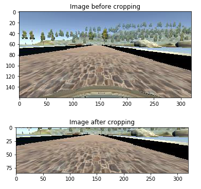
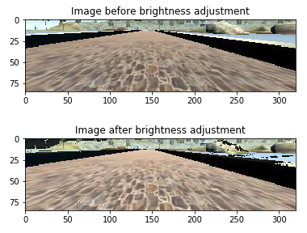
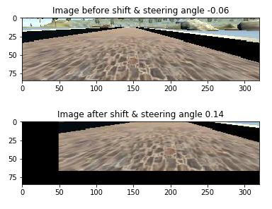
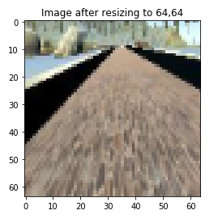

# **Behavioral Cloning** 
BY Xi Chen
---

The goals / steps of this project are the following:
* Use the simulator to collect data of good driving behavior
* Build, a convolution neural network in Keras that predicts steering angles from images
* Train and validate the model with a training and validation set
* Test that the model successfully drives around track one without leaving the road
* Summarize the results with a written report

## Introduction

I have been sice for the last couple of weeks, which made this project a little hard. However, I pull everything together and hope I can get a good grade.

One thing I learned is that end-to-end automatic driving is possible. In the files I submited I tested several models suggested by the course, which are not as good as NVidia's approach. The main goal of this project is to test whether only using deep convolutional neural networks (dCNN) to clone driving behavior of human. 

The framework is training and tested on the Keras package. And input image and process via cropping, resizing to 64x64 size, which can be fit in the modified NVidia suggested model. 

The main ranson to resize the images is to make the model run faster and more rubost. I tried with the original image size, which is slow and not consist while driving.

In the training model, user, here I drived around and capatured a lot images. One problem in this appoach is that the simulater was hard to manipulate, so the data collected has a lot of "noises", which could be a curse. Also data processing and augumentation was applied, which includes:

* Including left and right cam images
* Brightness adjustment
* Image flipping
* Imaging shifting
* Adding random shadow

Tested models are included in the previous_models folder, which requires the original driver.py file. (The current one is modified to output image size of 64x64.) 

## Model Architecture and Training Strategy

#### 1. An appropriate model architecture has been employed

My model is from the NVidia model and it's an end-to-end model, which is no hand-crafted features but image pixels. Line 161 in model.py.

The model includes elu layers to introduce nonlinearity, normalize layers to avoid color value bigger than 256 or less than 0 during the model training. Dropout layer, convolution layer and pooling layer are all included as standard CNN network approach. 

#### 2. Attempts to reduce overfitting in the model

The model contains dropout layers in order to reduce overfitting. In addition, a L2 regulation is employed to reduce overfitting 

The model was trained and validated on different data sets to ensure that the model was not overfitting. The dataset samples were divided in ratio of 80 and 20 for training and validation. The model was tested by running it through the simulator and ensuring that the vehicle could stay on the track.

#### 3. Model parameter tuning

The model used an adam optimizer with learning rate of 0.0001. I tested other LR and which are not quite good. Also the epoch size is 50. After 42 epoches, the loss has already reached plateus, so just makesure I round it to 50. Images generated through augumentation is about 20,000 and batch size is 128 per epoach.

#### 4. Appropriate training data

Training data was chosen to keep the vehicle driving on the road. I used a combination of center lane driving, recovering from the left and right sides of the road. 

For details about how I created the training data, see the next section. 

## Model Architecture and Training Strategy

#### 1. Solution Design Approach

The overall strategy for deriving a model architecture was to use image data only to predict steer angle.

My first step was to use a convolution neural network model similar to the NVidia model. I thought this model might be appropriate because the results from the paper is good and testing environment is quite similar to this project.

The NVidia model is here:

In order to gauge how well the model was working, I split my image and steering angle data into a training and validation set. I found that my first model that exactly like the NVidia one  and found it's a little slow while training. So I modified later into the 64x64 as imput image size. The paper didn't suggest a activation function to use, so I use the most famous one elu to provide no-linearity. The adam optimizer was used and dropout rate is 0.5 The mean squared error (MSE) Was used as loos function.

The result is decent, but I forgot to record the output.

#### 1. Final Model Architecture

The final model architecture (model.py lines 161) consisted of a convolution neural network with the following layers and layer sizes:

1. Lambda layer to normalized input images to avoid saturation and make gradients work better (Input image size 64x64x3)
2. Convolution: 5x5, filter: 24, strides: 2x2, activation: ELU, L2: 0.001
3. Dropout: 0.5
4. Convolution: 5x5, filter: 36, strides: 2x2, activation: ELU, L2: 0.001
5. Dropout: 0.5
6. Convolution: 5x5, filter: 48, strides: 2x2, activation: ELU, L2: 0.001
7. Dropout: 0.5
8. Convolution: 3x3, filter: 64, strides: 1x1, activation: ELU, L2: 0.001
90. Dropout: 0.5
10. Convolution: 3x3, filter: 64, strides: 1x1, activation: ELU, L2: 0.001
11. Dropout: 0.5
12. Flatten
13. Fully connected: neurons: 1164, activation: ELU, L2: 0.001
14. Dropout: 0.5
15. Fully connected: neurons: 100, activation: ELU, L2: 0.001
16. Dropout: 0.4
17. Fully connected: neurons: 50, activation: ELU, L2: 0.001
18. Dropout: 0.25
19. Fully connected: neurons: 10, activation: ELU, L2: 0.001
20. Fully connected: neurons: 1 (Output size 1x1)

Here is a visualization of the architecture (note: visualizing the architecture is optional according to the project rubric). Keras print out.
| Layer (type)                    | Output Shape        | Param     | Connected to |
| ------------------------------- | :------------------:| :-------: | :------------:
| lambda_1 (Lambda)               | (None, 64, 64, 3)   | 0         | lambda_input_1[0][0]
| convolution2d_1 (Convolution2D) | (None, 30, 30, 24)  | 1824      | lambda_1[0][0] 
| dropout_1 (Dropout)             | (None, 30, 30, 24)  | 0         | convolution2d_1[0][0]
| convolution2d_2 (Convolution2D) | (None, 13, 13, 36)  | 21636     | dropout_1[0][0]
| dropout_2 (Dropout)             | (None, 13, 13, 36)  | 0         | convolution2d_2[0][0]
| convolution2d_3 (Convolution2D) | (None, 5, 5, 48)    | 43248     | dropout_2[0][0] 
| dropout_3 (Dropout)             | (None, 5, 5, 48)    | 0         | convolution2d_3[0][0]
| convolution2d_4 (Convolution2D) | (None, 3, 3, 64)    | 27712     | dropout_3[0][0]
| dropout_4 (Dropout)             | (None, 3, 3, 64)    | 0         | convolution2d_4[0][0]
| convolution2d_5 (Convolution2D) | (None, 1, 1, 64)    | 36928     | dropout_4[0][0]
| dropout_5 (Dropout)             | (None, 1, 1, 64)    | 0         | convolution2d_5[0][0]
| flatten_1 (Flatten)             | (None, 64)          | 0         | dropout_5[0][0]
| dense_1 (Dense)                 | (None, 1164)        | 75660     | flatten_1[0][0]
| dropout_6 (Dropout)             | (None, 1164)        | 0         | dense_1[0][0]
| dense_2 (Dense)                 | (None, 100)         | 116500    | dropout_6[0][0] 
| dropout_7 (Dropout)             | (None, 100)         | 0         | dense_2[0][0]
| dense_3 (Dense)                 | (None, 50)          | 5050      | dropout_7[0][0]
| dropout_8 (Dropout)             | (None, 50)          | 0         | dense_3[0][0]
| dense_4 (Dense)                 | (None, 10)          | 510       | dropout_8[0][0] 
| dense_5 (Dense)                 | (None, 1)           | 11        | dense_4[0][0] 

#### 2. Creation of the Training Set & Training Process

To capture good driving behavior, I first recorded two laps on track one using center lane driving. After the collection process, I found my data are full of noise, which doesn't help with the model, I googled around and some suggested that to just use the data provided by the udacity. The reason might because when using a decrete control situation, model learn to drive decretedly which is jittering around. 

Accordint to the lections, it's possibile to use all three cameras, so I added +/-0.25 angles correction to the left and right camera image respectively. This correctin will help model to learn like it's from the center cam. 

Then lectures suggested to crop the image by removing 50 from to and 25 from bottom 
I finally randomly shuffled the data set and put Y% of the data into a validation set. 

To reduce the overfitting tendency of the model , image are augemented via following apprached before feeding into the model.

1. Brightness addjustment to handle uneven lighting, such at day and night.

2. Randomly Shfiting to help simulating different position on the row.

3. Flipping image to help simulating the opposition direction without driving backward.

4. I also tried to add shadow on the image, according to the suggested repo by tutor.

And finally I resize it into 64x64 size, so the model can run much faster. 

I also tried using images which have steering value < 0.1, so the model doen't become bias toward the center.

## Training and results:
As mentioned earlier, I use the epoch size of 50, after 50, the loos of training and validation will not deviate much at all. And the training and validation loss are both around 0.04, which I believe it's sufficient enough

The results is show in the video: [run1.mp4](run1.mp4). 
