# **Traffic Sign Recognition** 

## By Xi Chen

---

[//]: # (Image References)

[image1]: ./examples/visualization.jpg "Visualization"
[image2]: ./examples/grayscale.jpg "Grayscaling"
[image3]: ./examples/random_noise.jpg "Random Noise"
[image4]: ./examples/placeholder.png "Traffic Sign 1"
[image5]: ./examples/placeholder.png "Traffic Sign 2"
[image6]: ./examples/placeholder.png "Traffic Sign 3"
[image7]: ./examples/placeholder.png "Traffic Sign 4"
[image8]: ./examples/placeholder.png "Traffic Sign 5"

#### 1. Provide a Writeup / README that includes all the rubric points and how you addressed each one. You can submit your writeup as markdown or pdf. You can use this template as a guide for writing the report. The submission includes the project code.

You're reading it! and here is a link to my [project code iPython Notebook](Traffic_Sign_Classifier_Answers.ipynb)

### Data Set Summary & Exploration

#### 1. Provide a basic summary of the data set. In the code, the analysis should be done using python, numpy and/or pandas methods rather than hardcoding results manually.

I used the pandas library to calculate summary statistics of the traffic
signs data set:

* The size of training set is 34799
* The size of the validation set is 4410
* The size of test set is 12630
* The shape of a traffic sign image is (32, 32, 3)
* The number of unique classes/labels in the data set is 43

#### 2. Include an exploratory visualization of the dataset.

The dataset includes 43 different traffic signs as showed below:
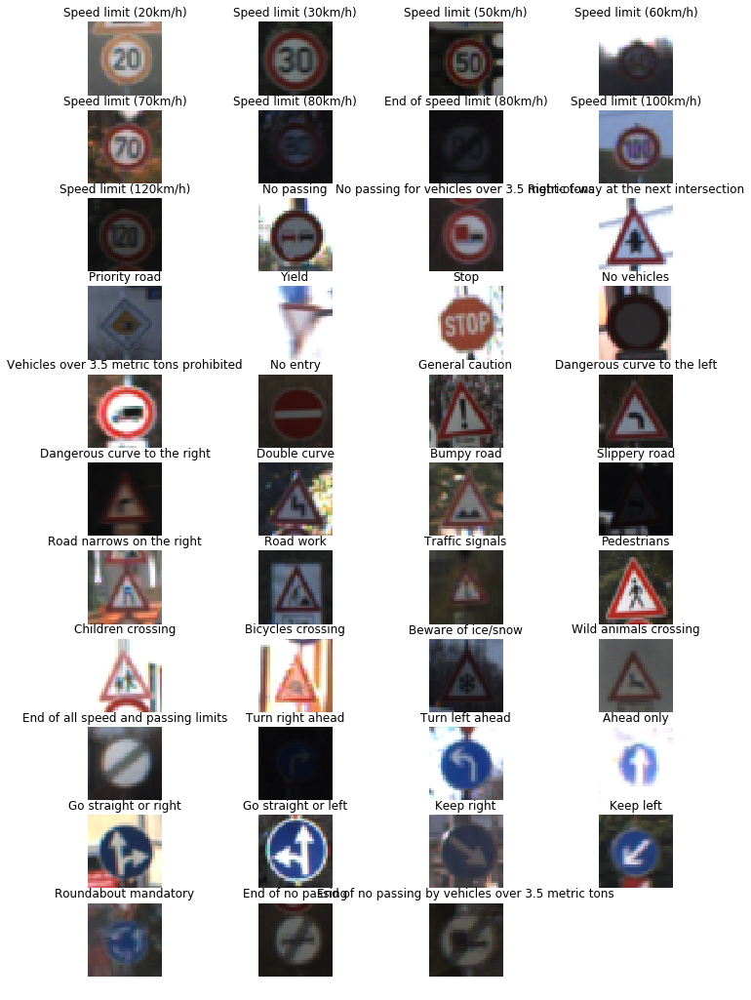

And the distribution of these 43 classes in all the datasets (training, validation, and test) are showed here:
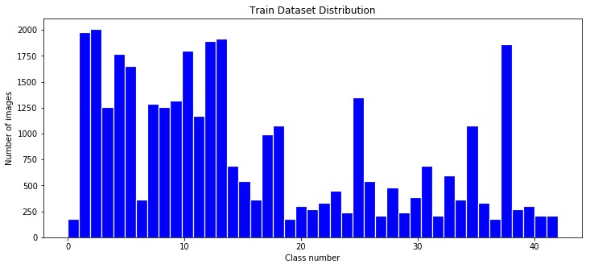
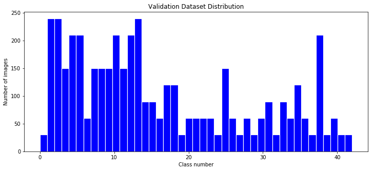
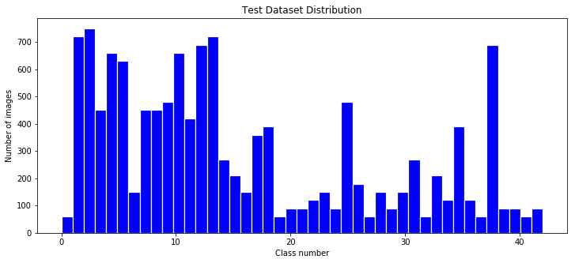

### Design and Test a Model Architecture

####1. Describe how you preprocessed the image data. What techniques were chosen and why did you choose these techniques? Consider including images showing the output of each preprocessing technique. Pre-processing refers to techniques such as converting to grayscale, normalization, etc. (OPTIONAL: As described in the "Stand Out Suggestions" part of the rubric, if you generated additional data for training, describe why you decided to generate additional data, how you generated the data, and provide example images of the additional data. Then describe the characteristics of the augmented training set like number of images in the set, number of images for each class, etc.)

As a first step, I decided to convert the images to normalized images and grayscale because it was recommanded in the notebook, and a lot of paper suggested it, since adding color doesn't add a lot of information.

Here is an example of a traffic sign image before and after normalization.

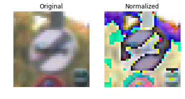

Here is an example of a traffic sign image before and after normalization + grayscale.

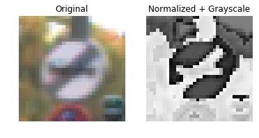

However, after I trained data, the normalization and grayscale doesn't improve the model. So the submited data I didn't normalize nor grayscale. I think, the reason behind it might be the small size of the image. 

Ater searched around, I found out a lot of paper and articles suggested to do the following:

1. Crop the image to a smaller size, so the model can focus only on the traffic sign instead of "behind-the-scene".
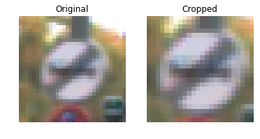

2. Histogram Equalization: Increase the contrast of the images with the cv2.equalizeHist function.
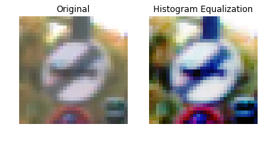

3. Gaussian Blur: to make the image more smooth.
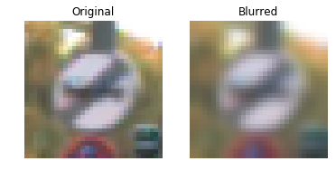

4. Translating the image + rotating the image + Affine Transformation: the reason to so this is to generate more data, which dramatically improve the model results.
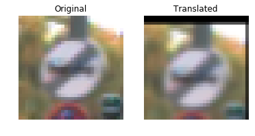
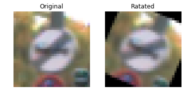
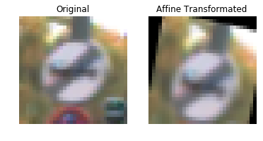

I decided to generate additional data because using only provided data, I only acieve a 67% accuracy, I asked around, and augument data is the "simplest" option for now. 

To add more data to the the data set, I used the following techniques (Translating the image + rotating the image + Affine Transformation)because it change the positons and angles of the images. This for the model to be robust.  

Here is an example of an original image and an augmented image (here I am using the images that I downloaded for the last part of the project, since they look better):

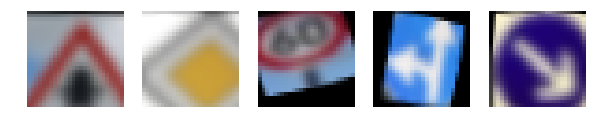

The difference between the original data set and the augmented data set is the following thye are cropped, increased contrast, smoothed, translated, rotated, and affine transformed.

#### 2. Describe what your final model architecture looks like including model type, layers, layer sizes, connectivity, etc.) Consider including a diagram and/or table describing the final model.

The LeNet architecture is really hard to manipulate, since I have to correct each input and output dimension individually for all the layers. So I leared to create each layer as a function with parameters passing in. The Architecture I am using is following the GoogleLeNet. My architecture incluces two inception module. And the input is 26x26x3 image and out put is 1x43 classes. The detail of the inception model can be found from the Andrew Ng's Convolution NN lecture Week 3 & 4, but the general idea is "why choose trail them all". So instead of returning one convolution output each layer, the inception model tral 4 convolutions, and then concatimate then together.

Inception Module is as following:

My final model consisted of the following layers:

| Layer         		|     Description	        					| 
|:---------------------:|:---------------------------------------------:| 
| Input         		| 26x26x3 RGB image   							| 
| Convolution 1x1     	| 1x1 stride, same padding, outputs 26x26x3 	|
| RELU					|												|
| Convolution 5x5       | 1x1 stride, same padding, outputs 26x26x64    |
| RELU					|												|
| Inception Module      | Output 26x26x256    |
| Max pooling	      	| 2x2 stride, outputs 13x13x256 				|
| Inception Module      | Output 13x13x512    |
| Max pooling	      	| 3x3 stride, outputs 6x6x512 				|
| Convolution 1x1	    | 1x1 stride, same padding, outputs 6x6x256	|
| Fully connected		| output 512 |
| Dropout				| 50% |
| Softmax				| output 43        					|

 

#### 3. Describe how you trained your model. The discussion can include the type of optimizer, the batch size, number of epochs and any hyperparameters such as learning rate.

To train the model, I used following values:
* EPOCHS = 15 
* BATCH_SIZE = 128 
* Optimizer = AdamOptimizer
* Learning rate = 0.0005
* Dropout = 0.5

Hyperparameters for the layers are:
* mu = 0.0 
* sigma = 0.1 

#### 4. Describe the approach taken for finding a solution and getting the validation set accuracy to be at least 0.93. Include in the discussion the results on the training, validation and test sets and where in the code these were calculated. Your approach may have been an iterative process, in which case, outline the steps you took to get to the final solution and why you chose those steps. Perhaps your solution involved an already well known implementation or architecture. In this case, discuss why you think the architecture is suitable for the current problem.

My final model results were:
* training set accuracy of 0.997
* validation set accuracy of 0.972 
* test set accuracy of 0.957

If an iterative approach was chosen:
* What was the first architecture that was tried and why was it chosen?
The first model I tried is the provided LeNet model. 
* What were some problems with the initial architecture?
The accuracy is too low, only about 0.6~. 
* How was the architecture adjusted and why was it adjusted? Typical adjustments could include choosing a different model architecture, adding or taking away layers (pooling, dropout, convolution, etc), using an activation function or changing the activation function. One common justification for adjusting an architecture would be due to overfitting or underfitting. A high accuracy on the training set but low accuracy on the validation set indicates over fitting; a low accuracy on both sets indicates under fitting.

* Which parameters were tuned? How were they adjusted and why?
Epoch, learning rate, batch size, and drop out rate. These are the general parameter that can be adjusted easily, but none worked. Increased epoches is the fundamental adjust, since it represented how many round you trained, it's very unplasent, to see the accuracy reach plateuats. The batch size is also important, but the give 128 was acceptable, the learning rate was roughly right, the drop out rate was suggested by multiple resources. 

* What are some of the important design choices and why were they chosen? For example, why might a convolution layer work well with this problem? How might a dropout layer help with creating a successful model?
1. Drop out: it was recommended by several articles, and the reason given was it's important to forget. 
2. Inception neuron: which was suggested by Google, their approach is use all the covolution layers on one node and concatimate them together make a huge tensor.

If a well known architecture was chosen:
* What architecture was chosen? 
I would use the GoogLeNet architecture.
* Why did you believe it would be relevant to the traffic sign application?
Reputation and results.
* How does the final model's accuracy on the training, validation and test set provide evidence that the model is working well?
All the accuracy increased. 
 

### Test a Model on New Images

#### 1. Choose five German traffic signs found on the web and provide them in the report. For each image, discuss what quality or qualities might be difficult to classify.

Here are five German traffic signs that I found on the web:

I don't think neither of the image is difficult, since they are quite good quality (clear). The second one might cause problem for the model, because the angle.

#### 2. Discuss the model's predictions on these new traffic signs and compare the results to predicting on the test set. At a minimum, discuss what the predictions were, the accuracy on these new predictions, and compare the accuracy to the accuracy on the test set (OPTIONAL: Discuss the results in more detail as described in the "Stand Out Suggestions" part of the rubric).

Here are the results of the prediction:

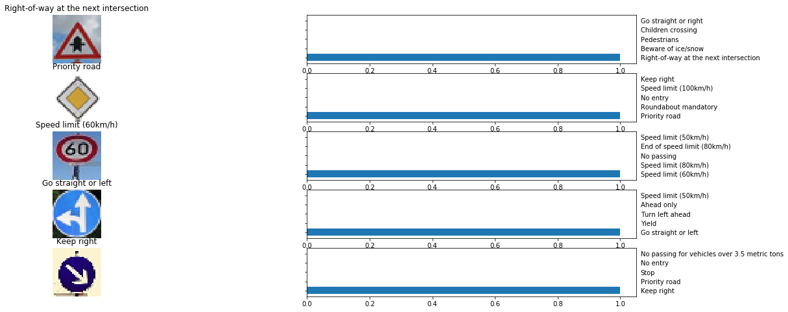

The model was able to correctly guess 5 of the 5 traffic signs, which gives an accuracy of 100%. This compares favorably to the accuracy on the test set of originally given.

#### 3. Describe how certain the model is when predicting on each of the five new images by looking at the softmax probabilities for each prediction. Provide the top 5 softmax probabilities for each image along with the sign type of each probability. (OPTIONAL: as described in the "Stand Out Suggestions" part of the rubric, visualizations can also be provided such as bar charts)

The code for making predictions on my final model is located in the 14th cell of the Ipython notebook.

All the prediction are correct without second guess, here is the recap of the results (reused the image). (I didn't know you asked us to seperate the results.

