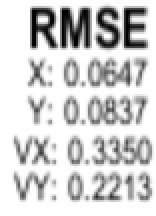

# Unscented Kalman Filter Project Submission
## by Xi Chen, May 23, 2018

**Note:** Sorry that I am late, I was trying to finish a paper, which is graduation requirement and I was traveling for presinting my poster in California for about 2 weeks for 2 conference. Thank you for understanding!

### Introduction:
You are reading Self-Driving Car Engineer Nanodegree Program, Unscented Kalman Filter Project, submission document 

In this project utilize an Unscented Kalman Filter to estimate the state of a moving object of interest with noisy lidar and radar measurements. It involves the Term 2 Simulator which can be downloaded [here](https://github.com/udacity/self-driving-car-sim/releases)

This repository includes two files that can be used to set up and intall [uWebSocketIO](https://github.com/uWebSockets/uWebSockets) for either Linux or Mac systems. For windows you can use either Docker, VMware, or even [Windows 10 Bash on Ubuntu](https://www.howtogeek.com/249966/how-to-install-and-use-the-linux-bash-shell-on-windows-10/) to install uWebSocketIO. Please see [this concept in the classroom](https://classroom.udacity.com/nanodegrees/nd013/parts/40f38239-66b6-46ec-ae68-03afd8a601c8/modules/0949fca6-b379-42af-a919-ee50aa304e6a/lessons/f758c44c-5e40-4e01-93b5-1a82aa4e044f/concepts/16cf4a78-4fc7-49e1-8621-3450ca938b77) for the required version and installation scripts.


INPUT: values provided by the simulator to the c++ program

["sensor_measurement"] => the measurment that the simulator observed (either lidar or radar)


OUTPUT: values provided by the c++ program to the simulator

    ["estimate_x"] <= kalman filter estimated position x
    ["estimate_y"] <= kalman filter estimated position y
    ["rmse_x"]
    ["rmse_y"]
    ["rmse_vx"]
    ["rmse_vy"]

---

### Other Important Dependencies
* cmake >= 3.5
  * All OSes: [click here for installation instructions](https://cmake.org/install/)
* make >= 4.1 (Linux, Mac), 3.81 (Windows)
  * Linux: make is installed by default on most Linux distros
  * Mac: [install Xcode command line tools to get make](https://developer.apple.com/xcode/features/)
  * Windows: [Click here for installation instructions](http://gnuwin32.sourceforge.net/packages/make.htm)
* gcc/g++ >= 5.4
  * Linux: gcc / g++ is installed by default on most Linux distros
  * Mac: same deal as make - [install Xcode command line tools](https://developer.apple.com/xcode/features/)
  * Windows: recommend using [MinGW](http://www.mingw.org/)

## Basic Build Instructions

1. Clone this repo.
2. Make a build directory: `mkdir build && cd build`
3. Compile: `cmake .. && make`
4. Run it: `./UnscentedKF` Previous versions use i/o from text files.  The current state uses i/o
from the simulator.

## Results
I have been able to compile my code and here is the console output:
```
-- Configuring done
-- Generating done
-- Build files have been written to: /Users/bill/Documents/Education/Udacity/CarND_GitHub/Term2/P2_CarND-Unscented-Kalman-Filter-Project/build
Scanning dependencies of target UnscentedKF
[ 25%] Building CXX object CMakeFiles/UnscentedKF.dir/src/ukf.cpp.o
/Users/bill/Documents/Education/Udacity/CarND_GitHub/Term2/P2_CarND-Unscented-Kalman-Filter-Project/src/ukf.cpp:258:1: warning: 
      '/*' within block comment [-Wcomment]
/** Borrowed from the exercise and modified
^
/Users/bill/Documents/Education/Udacity/CarND_GitHub/Term2/P2_CarND-Unscented-Kalman-Filter-Project/src/ukf.cpp:259:1: warning: 
      '/*' within block comment [-Wcomment]
/*******************************/
^
2 warnings generated.
[ 50%] Linking CXX executable UnscentedKF
ld: warning: directory not found for option '-L/usr/local/Cellar/libuv/1*/lib'
[100%] Built target UnscentedKF
```

The results is showing here:



### Comparing with the Project 1
The previous project result is
```Accuracy - RMSE:
0.0973178
0.0854597
0.451267
0.439935
```

Current result is 
```Accuracy - RMSE:
0.0647
0.0837
0.3350
0.2213
```

The results do improve, which is no suprise. However I found out the velocity on y direction improved much more than the x direction, and the position value on x direction is better. I think the might because the orientation of the driving direction. Because when driving, the car is moving ahead, for the car itself, it's the y-direction velocity driven the movement, so the RMSE is smaller than the x-direction. However, when driving, the x-direction position shouldn't be deviate a lot, since we drive straight. I am not sure my explainations is correct or not. Please do let me know. 


## Discussion
This project start code didn't included the helper function that we used in the exercises. So it was a little confusing about what the expectation of the project. So I googled other people's approaches and compared codes, and figured out what I need to do. The git repo I looked is: https://github.com/jessicayung/self-driving-car-nd/blob/master/term-2/p2-unscented-kalman-filter. 


### Problems
1. Would you mind to tell me in the comments how to switch off one of the sensor. I tried to set ```use_laser_ = false;``` or ```use_radar_ = false;```, and the results don't change much at all. Can you tell me why? I also include the cout in the update functions and even I switch one sensor off, it's still updated.

2. For generating new data points, is the python one working? I don't have matlab, which costs money. For the python one, do you know the python version? It's a little buggy.


