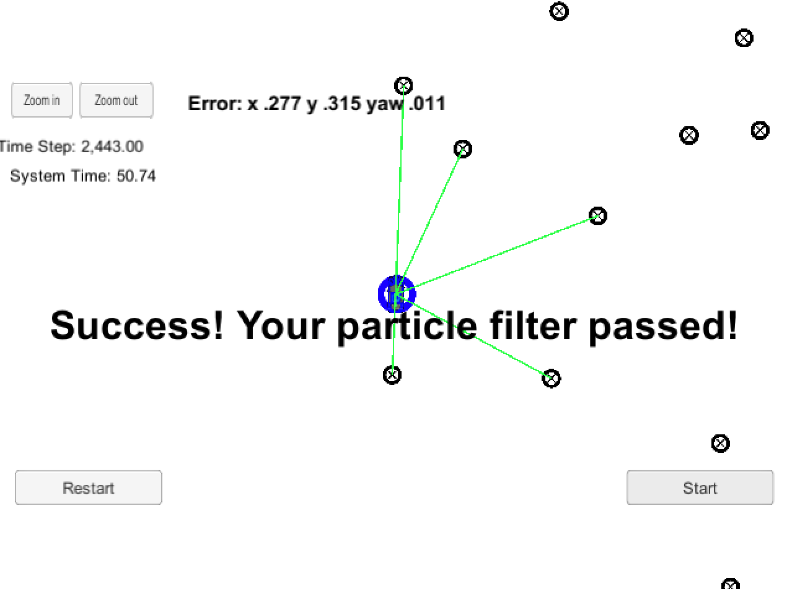

# Porject 3 Kidnapped Vehicle Project

### NOTE: there's a bug in the simulator on Mac platform. It causes the simulation running but the weights don't update to the simulator. Hope you guys can fix it in the future.


## Project Introduction
Your robot has been kidnapped and transported to a new location! Luckily it has a map of this location, a (noisy) GPS estimate of its initial location, and lots of (noisy) sensor and control data.

In this project you will implement a 2 dimensional particle filter in C++. Your particle filter will be given a map and some initial localization information (analogous to what a GPS would provide). At each time step your filter will also get observation and control data. 

## Running the Code
To run the code, please execute the following in the top directory of the project:

1. ./clean.sh
2. ./build.sh
3. ./run.sh

Tips for setting up your environment can be found [here](https://classroom.udacity.com/nanodegrees/nd013/parts/40f38239-66b6-46ec-ae68-03afd8a601c8/modules/0949fca6-b379-42af-a919-ee50aa304e6a/lessons/f758c44c-5e40-4e01-93b5-1a82aa4e044f/concepts/23d376c7-0195-4276-bdf0-e02f1f3c665d)

## Results

My job is to build out the methods in `particle_filter.cpp` and the simulator output says:



# Implementing the Particle Filter
The directory structure of this repository is as follows:

```
root
|   build.sh
|   clean.sh
|   CMakeLists.txt
|   README.md
|   run.sh
|
|___data
|   |   
|   |   map_data.txt
|   
|   
|___src
    |   helper_functions.h
    |   main.cpp
    |   map.h
    |   particle_filter.cpp
    |   particle_filter.h
```

## Discussion
I used different number of particles, and I feel confortable with the number of 100, which is fast enough, and have a better results. The simulation was passed the test and with the position errors for x and y directions and yaw of 0.277, 0.315, 0.011. 

I also check this [repo](https://github.com/jessicayung/self-driving-car-nd/blob/master/term-2/p3-kidnapped-vehicle/src/particle_filter.cpp) and use it as reference. However, I feel my implementation is better than the one from the repo. 

Thanks.


